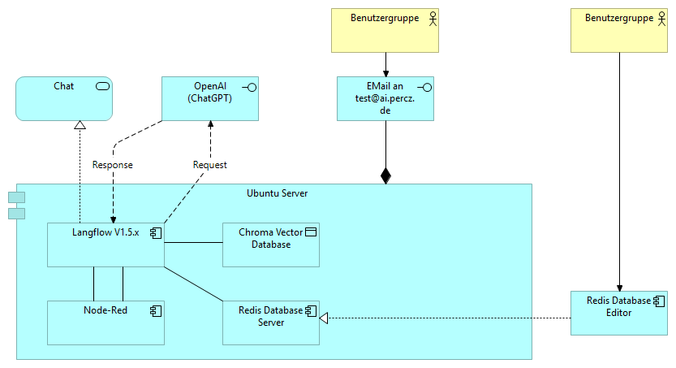

# Agenten-Backend mit LangChain und FastAPI 
**Ubuntu-kompatibel**

Ein modulares Agentensystem auf Basis von **LangChain**, **FastAPI** und optionalem Speicher. Ziel ist die lokale, aber skalierbare Interaktion mit KI-Agenten – unterstützt durch Tools, Gedächtnis, Mehrnutzersitzung und verteilbare Komponenten.

---

## 🚀 Zielsetzung

- Lokaler KI-Agent über REST-API
- Sitzungsbasiertes Gedächtnis (UUID)
- Erweiterbar durch Tools, Events und weitere Agenten
- Entwicklerfreundlich, mit Fokus auf Wartbarkeit und Modularität

---

## 📦 Ubuntu 24.04+ – Vorbereitung & Installation

### 1. Systempakete installieren
```bash
sudo apt update && sudo apt upgrade -y

# Python & Tools
sudo apt install -y python3 python3-venv python3-pip build-essential libssl-dev libffi-dev git curl direnv
```

### 2. Repository klonen (bzw. Projektstruktur kopieren)
```bash
git clone https://github.com/KaiPercz/KI-Agentensystem.git
cd KI-Agentensystem
cd Agenten-Backend_Ubuntu
```

⚠️ Wichtig: Bitte installiere alle Python-Abhängigkeiten innerhalb einer virtuellen Umgebung. Globale Installationen sind aufgrund des Sicherheitsmechanismus externally-managed-environment nicht erlaubt.

### 3. Projektstruktur einrichten
```bash
python3 -m venv venv
```

### 4. direnv vorbereiten
Aktiviere direnv in deiner Shell:
```bash
echo 'eval "$(direnv hook bash)"' >> ~/.bashrc
source ~/.bashrc
```

### 5. API-Key konfigurieren (lokal)
```bash
echo "sk-..." > .openai_key
chmod 600 .openai_key
echo ".openai_key" >> .gitignore
```

### 6. Umgebung initialisieren
```bash
source ./venv/bin/activate
```

### 7. Python-Abhängigkeiten installieren
```bash
pip install --upgrade pip setuptools wheel
pip install -U langchain-community
pip install -r requirements.txt
```

### 8. Ergebnis prüfen
```bash
which python
# sollte in ./venv/... enden

pip list
# zeigt nur lokal installierte Pakete
```

### 9. Backend starten
```bash
uvicorn main:app --host 0.0.0.0 --port 7860
```

Test per Curl:
```bash
curl -X POST http://localhost:7860/ask \
     -H "Content-Type: application/json" \
     -d '{"question": "Was ist die Hauptstadt von Kanada?", "session_id": "demo-uuid"}'
```

### 10. weitere Komponenten für das Backend

