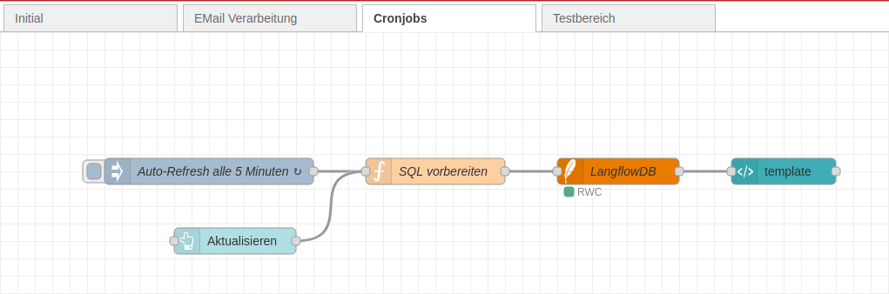

# 🧾 Node-RED Flow: HTML-Status-Template-Update für TravelAgent-Prozess

## Übersicht

Dieser Node-RED-Flow dient der **zyklischen Aktualisierung eines individuellen HTML-Templates**, das dem Benutzer den **aktuellen Status eines TravelAgent-Prozesses** anzeigt. Die Anzeige basiert auf einer Gruppierung nach `session_id` und wird aus einer Datenbank generiert.

Es handelt sich **nicht** um die Beantwortung der Anfrage selbst, sondern ausschließlich um die **Statusdarstellung der bereits verarbeiteten Anfrage(n)**.

---

## 🌐 Architekturübersicht

```plaintext
[TravelAgent (Trigger)]
    ↓
[Antwort Camping Travelagent]
    ├─→ [Set HTTP 200] → [Antwort]
    ├─→ [Antwort Reise Agent]   (Debug/Visualisierung)
    ├─→ [Aufbereitung] → [HTML-Ausgabe]
    └─→ [Session ID ermitteln] → [Daten generieren] → [TestDB]
```

📌 Komponentenbeschreibung

| Komponente                      | Funktion                                                                             |
| ------------------------------- | ------------------------------------------------------------------------------------ |
| **TravelAgent (Trigger)**       | Startpunkt des Flows, wenn neue Statusinformationen zum Prozess vorliegen.           |
| **Antwort Camping Travelagent** | Nimmt Statusdaten aus einem anderen Agent entgegen (z. B. Langflow).                 |
| **Set HTTP 200**                | Sendet eine Bestätigung an den Aufrufer zurück.                                      |
| **Antwort**                     | Rückmeldung an das Quellsystem/API.                                                  |
| **Antwort Reise Agent**         | Ausgabe der vollständigen Antwort zur Kontrolle (z. B. Debug-View).                  |
| **Aufbereitung**                | Generiert eine HTML-Statusansicht gruppiert nach `session_id`.                       |
| **HTML-Ausgabe**                | Übergibt die generierten Inhalte zur Anzeige an ein Frontend oder Monitoring-System. |
| **Session ID ermitteln**        | Ermittelt oder prüft die zugehörige `session_id`.                                    |
| **Daten generieren**            | Formatiert die Daten für den Eintrag in die Datenbank.                               |
| **TestDB**                      | Persistiert Statusdaten zur späteren Abfrage und Anzeige.                            |


✅ Ablaufbeschreibung
1. Status-Ereignis: Ein Prozess (z. B. Reiseberatung) ist abgeschlossen oder liefert einen Zwischenstand.
2. Verarbeitung: Der Flow nimmt den Status auf, extrahiert die session_id und speichert strukturierte Daten in der TestDB.
3. HTML-Template-Erzeugung: Ein zyklischer Prozess liest diese Daten aus der Datenbank, gruppiert sie nach session_id und formatiert sie als HTML.
4. Anzeige: Das generierte Template wird in einem Frontend dargestellt (z. B. im Browser, Dashboard oder über eine API verfügbar gemacht).


### Ablauf des Cronjobs im Backend Node-Red



💡 Verwendungsszenarien
- Fortschrittsanzeige in Benutzer-Dashboards
- Transparente Einsicht in Status und Ergebnisse von Agentenprozessen
- Gruppierte Visualisierung laufender Sessions


🔒 Session-Verfolgung
| Feld         | Beschreibung                                      |
| ------------ | ------------------------------------------------- |
| `session_id` | Eindeutige ID zur Prozessverfolgung               |
| `status`     | Textlicher Status (z. B. "Analyse abgeschlossen") |
| `zeitpunkt`  | Zeitstempel der Statusaktualisierung              |
| `quelle`     | Ursprungs-Agent des Status (z. B. Langflow)       |


🛠️ Erweiterungsideen (Roadmap)
| Thema                          | Status     |
| ------------------------------ | ---------- |
| Interaktive Web-Darstellung    | In Planung |
| PDF-Export der Statusübersicht | Offen      |
| Session-basierte Filter-API    | Geplant    |
| Mehrsprachige Templates        | In Planung |
| Delta-Status-Vergleiche        | Offen      |


📎 Anhang
Diese Dokumentation beschreibt einen Node-RED-Flow zur Erstellung und zyklischen Anzeige von HTML-basierten Statusübersichten für Benutzerprozesse. Der Flow greift auf eine Datenbank zu, gruppiert die Daten nach session_id und erzeugt daraus Templates zur Darstellung des aktuellen Prozessstandes. Ein Versand per E-Mail findet nicht statt.
