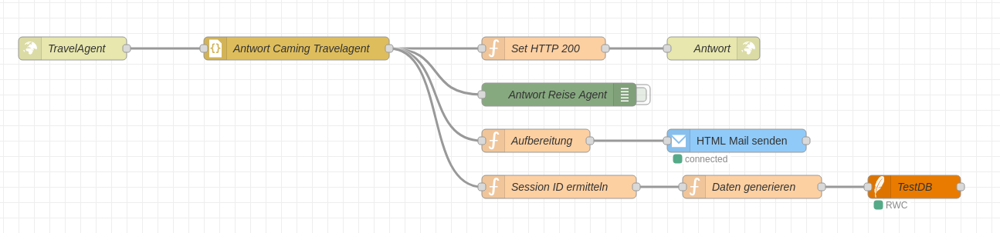

# 🏕️ Node-RED Flow: TravelAgent (Camping-Spezifische Antwortverarbeitung)

## Übersicht

Dieser Node-RED-Flow verarbeitet Antworten eines spezialisierten „TravelAgent“, insbesondere für Camping-Anfragen. Nach dem Empfang erfolgt eine strukturierte Aufbereitung, Ausgabe als HTML-E-Mail, Session-Verfolgung sowie Protokollierung in eine Datenbank.

---

## 🌐 Architekturübersicht

```plaintext
[TravelAgent]
    ↓
[Antwort Camping Travelagent]
    ├─→ [Set HTTP 200] → [Antwort]
    ├─→ [Antwort Reise Agent]
    ├─→ [Aufbereitung] → [HTML Mail senden]
    └─→ [Session ID ermitteln] → [Daten generieren] → [TestDB]
```

📌 Komponentenbeschreibung
| Komponente                      | Funktion                                                                                 |
| ------------------------------- | ---------------------------------------------------------------------------------------- |
| **TravelAgent (Input)**         | Eingangspunkt für Antworten vom Camping-Reiseagenten.                                    |
| **Antwort Camping Travelagent** | Konsolidierung der empfangenen Nachricht.                                                |
| **Set HTTP 200**                | Signalisiert erfolgreichen Empfang der Antwort.                                          |
| **Antwort**                     | Sendet ggf. synchronen HTTP-Antworttext zurück.                                          |
| **Antwort Reise Agent**         | Übergibt das vollständige Antwortobjekt z. B. an vorherige Flows oder UI.                |
| **Aufbereitung**                | Extrahiert, normalisiert oder formatiert die Nutzdaten.                                  |
| **HTML Mail senden**            | Versendet eine HTML-formatierte Antwort per E-Mail an einen Empfänger.                   |
| **Session ID ermitteln**        | Extrahiert oder generiert eine eindeutige Sitzungs-ID zur Nachverfolgung.                |
| **Daten generieren**            | Erstellt strukturierte Daten für Logging und Analyse.                                    |
| **TestDB (Protokollierung)**    | Persistiert alle relevanten Informationen in einer Datenbank (z. B. SQLite, PostgreSQL). |


✅ Prozessschritte
1. Eingang: Antwort vom TravelAgent (z. B. nach einem Langflow-Call).
2. Session-Handling: Session-ID wird identifiziert (zur Nachvollziehbarkeit).
3. HTTP-Bestätigung: Ein 200 OK wird zurückgegeben.
4. Aufbereitung: Daten werden ggf. formatiert (z. B. Preis, Ort, Datum).
5. E-Mail-Versand: Eine HTML-formatierte Mail wird an den Benutzer gesendet.
6. Logging: Session-ID und relevante Daten werden in der TestDB protokolliert.
7. Optionale Anzeige: Die Antwort Reise Agent kann für Debug oder UI weiterverwendet werden.

dazu bereitgestellte Flows im Backend Node-Red



✉️ E-Mail-Handling
Die Komponente HTML Mail senden nutzt strukturierte, vorbereitete Daten, um dem Benutzer eine ansprechend formatierte Antwort zu liefern. Mögliche Inhalte:

- Campingplatz-Empfehlungen
- Verfügbarkeiten
- Links zu Buchungsplattformen
- Preis- und Standortinformationen


📂 Hinweise zur Wartung
- Session-ID sollte eindeutig und überprüfbar sein (z. B. UUID oder Zeitstempel-basiert).
- Die Datenbank TestDB sollte regelmäßig gesichert und auf Konsistenz geprüft werden.
- Fehler im E-Mail-Versand (SMTP o. ä.) sollten über ein separates Logging gehandhabt werden.
- Die HTML-Mail-Vorlage sollte regelmäßig auf Benutzerfreundlichkeit und Responsivität geprüft werden.


🛠️ Erweiterungsideen (Roadmap)

| Thema                                | Status     |
| ------------------------------------ | ---------- |
| Alternative Ausgabe per PDF (Anhang) | Geplant    |
| Logging mit Logleveln (Info/Error)   | In Planung |
| Zeitgesteuertes Re-Triggering        | Offen      |
| Internationalisierung der E-Mail     | Optional   |

📎 Anhang

Dieses Dokument beschreibt den Node-RED-Flow zur Verarbeitung von Rückmeldungen durch einen spezialisierten Reiseagenten (Camping-Fokus). Der Flow umfasst Verarbeitung, Session-Handling, Versand einer HTML-E-Mail und Protokollierung in eine Datenbank. (Stand: August 2025)
